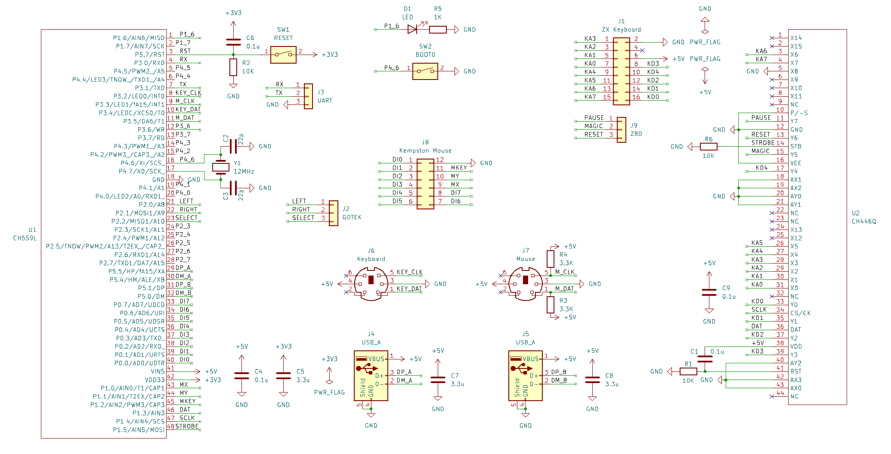

# HIDman ZX
Адаптер USB и PS/2 клавиатур/мышей для ZX Spectrum.

## Входные требования:
- Разработать универсальный простой в повторении недорогой открытый интерфейс USB / PS/2 клавиатур и мышей.
- Должны поддерживаться как минимум два USB устройства одновременно
- Включает прошивку микроконтроллера, референсную минимальную схему включения и пример тестовой платы в KiCad
- Основной фокус на сопровождаемости прошивки микроконтроллера
- Выход интерфейса клавиатуры: сигналы матрицы переключателей A8-A15, D0-D4
- Выход интерфейса Kempston Mouse: сигналы DI0-DI7, стробы записи регистров MX, MY, MKEY

**Дополнительно:**
- Поддержка USB HID геймпадов для эмуляции кнопок клавиатуры
- Выход сигналов для управления кнопками эмулятора дисковода GOTEK по горячим кнопкам клавиатуры
- Выход сигналов управления Z80 по горячим кнопкам клавиатуры: BUSRQ (PAUSE), NMI(MAGIC), RESET

**Не входит в требования:**
- Реализация платы для ZX-BUS
- Реализация портов и регистров контроллеров ZX клавиатуры и Kempston Mouse
- Реализация защиты портов USB от статики / короткого замыкания / повышенного напряжения

## Реализация
В качестве основы проекта был взят проект [HIDman](https://github.com/rasteri/HIDman): USB HID to XT / AT / PS/2 / Serial converter : адаптер USB устройств в PS/2 keyboard/mouse device. От HIDman была взята реализация стека USB Host без модификаций.

Схема использует недорогие доступные чипы от [Nanjing Qinheng Microelectronics](https://www.wch-ic.com):
- 8-bit Enhanced USB MCU [CH559L]("doc/8-bit Enhanced USB MCU CH559 Datasheet 1.6.pdf"): расширенный Intel 8051 совместимый микроконтроллер с двумя аппаратными USB Host
- 8x16 Analog Switch Array Chip [CH446Q]("doc/8x16 Analog Switch Array Chip CH446Q Datasheet 1D.pdf"): матрица аналоговых ключей 8x16 с последовательным интерфейсом

В код добавлены:
- реализация асинхронных интерфейсов PS/2 клавиатуры и мыши
- реализация матрицы контактов 8x5 ZX Spectrum клавиатуры с раскладкой Xrust
- интерфейс матрицы ключей CH446Q
- Интерфейс для контроллера Kempston Mouse (DI+MX/MY/MKEY)
- Интерфейс управления Z80 (PAUSE/MAGIC/RESET) по клавишам F10/F11/F12
- Интерфейс управления кнопками GOTEK (RIGHT/LEFT/SELCT) по сочетанию клавиш CTRL+ RIGHT/LEFT/DOWN/UP

## Детали реализации

Тестовая плата для отладки присоединяется сверху к [ZX Spectrum Pentagon 128 2023/2024 Interface Board](https://github.com/proboterror/Pentagon_128_Interface_Board). Исходя из этого выбраны физические размеры и положение / распиновка разъема клавиатуры.

Интерфейс мыши расчитан на подсоединение к контроллеру, подобному [ZX_BUS_Mouse](https://github.com/proboterror/ZX_BUS_Mouse) с параллельной записью по шине 8-bit в регистры осей и колеса/кнопок. Колесо прокрутки мыши поддержано.

Исходный код поддержки PS/2 клавиатуры и интерфейса матрицы ZX Spectrum => CH446Q портирован из проекта расширенного интерфейса [ZX_RGBI2VGA-HDMI + GOTEK FlashFloppy I2C OSD + PS/2 Keyboard](https://github.com/proboterror/zx-rgbi-to-vga-hdmi_gotek-osd)

Исходный код поддержки PS/2 мыши портирован из экспериментальной ветки interrupt_processing_async проекта [ZX BUS Mouse](https://github.com/proboterror/ZX_BUS_Mouse/tree/interrupt_processing_async). Код обработки мыши по прерыванию clock в свою очередь основан на проекте Олега Трифонова [avr-mouse-ps2-to-serial](https://github.com/trol73/avr-mouse-ps2-to-serial). Код инициализации PS/2 мыши и основной цикл обработки событий асинхронный с минимальными задержками.

##Режимы работы выходов
Входы / выходы матрицы клавиатуры A8-A15, D0-D4 и управляющих сигналов Z80 BUSRQ, NMI, RESET подключены к входам / выходам матрицы аналоговых ключей CH446Q. Общий вход X8 для BUSRQ, NMI, RESET подключен к GND.

Выходы кнопок работают в режиме с открытым коллектором, при нажатии замыкают на GND.

Выход интерфейса Kempston Mouse работает в режиме push-pull.

## Схема

## Тестовая плата


## Текущий статус
- В firmware реализована поддержка USB мышей и клавиатур. 
- Тестирование режимов выходных портов мыши / клавиатуры в процессе.
- Тестовая плата в производстве.
- Поддержка USB хабов и конфигурация беспроводная клавиатура/мышь + gamepad не тестировались, но заявлены в оригинальном проекте.
- События от USB HID геймпадов не транслируются в нажатия кнопок клавиатуры.

## ToDo
- Код обработки событий от PS/2 клавиатуры не обрабатывает ошибки parity. После тестирования стабильности работы уточнить необходимость отправки устройству PS/2 команды RESEND / RESET и очистки буфера ввода.
- Добавить минимальный код трансляции нажатия кнопок USB HID gamepad в события клавиатуры.

## Сборка проекта
Для сборки прошивки из исходников потребуются: компилятор SDCC 3.9.3, GNU утилиты в составе msys2.
- Скопировать / установить [SDCC 3.9.3](https://github.com/atc1441/CH559sdccUSBHost/tree/master/SDCC). Добавить путь к SDCC/bin в переменную окружения PATH.
- Установить [MSYS2](https://www.msys2.org/). Путь к msys64/usr/bin должен быть в PATH.

Компиляция:
```
cd firmware
build-release.bat
```
Файлы прошивки сохраняются в каталоге firmware/out

## Прошивка CH559L
Необходимо установить [WCH ISP Studio](https://www.wch.cn/downloads/WCHISPTool_Setup_exe.html)
См. оригинальную инструкцию по прошивке ниже.

Потребуется кабель USB A - USB A (вилка - вилка).

Вход в режим програмирования:
- Запустить WCH ISP Studio, выбрать режим 
- Отсоединить контроллер от внешнего питания / устройств
- Замкнуть jumper BOOT0 (P4.6)
- Подключить контроллер через разъем USB_A к ПК
- Контроллер должен появиться в списке Dev list
- При неудаче повторить

- Выбрать файл прошивки
- Нажать Download
- При неудаче повторить

- Процедура прошивки может быть нестабильной / очень нестабильной в зависимости от контроллера USB в ПК.
- Вход в режим программирования может меняться для нового и прошитого контроллера (уточнить).
- Вход в режим программирования через запуск bootloader'а прошивкой при сбросе (BOOT1 + RESET) не тестировался
- Для CH559L заявлена поддержка serial programmer, на практике ПО и описания для этого нет.

## Схожие проекты
[Контроллер для USB клавиатуры и мыши](https://zx-pk.ru/threads/34912-kontroller-dlya-usb-klaviatury-i-myshi.html)
[[github]](https://github.com/Igor-azx987sa/ZXKM)<br>
(С) Игорь Матвеев @azx987sa 2023<br>
Микроконтроллер ATmega328P, USB HOST controller CH9350, EPM7128<br>

[PentagonExpander](https://github.com/MikhaelKaa/pentagonexpander) (WiP)<br>
(С) Михаил Каа MikhaelKaa 2023<br>
Микроконтроллер STM32, CPLD EPM7128: 1 USB Host и PS/2 мышь / клавиатура

[USB2SPECTRUM](https://github.com/MikhaelKaa/usb2spectrum) (WiP)<br>
(С) Михаил Каа MikhaelKaa 2023-2024<br>
USB клавиатура / gamepad, PS/2 клавиатура, Kempston Joystick.<br>
Микроконтроллер STM32, CPLD EPM7064

[Периферийный контроллер для Скорпиона с поддержкой USB](https://zx-pk.ru/threads/34458-periferijnyj-kontroller-dlya-skorpiona-s-podderzhkoj-usb.html)
[[github]](https://github.com/psk7/scorpion-card-pub)<br>
(С) Kireev Sergey psk 2022<br>
Микроконтроллер ATmega328P, USB HOST controller MAX3421EEHJ, EPM3064

[usb_to_zx_spectrum](https://github.com/billgilbert7000/usb_to_zx_spectrum)<br>
(C) Constantin billgilbert7000 2024<br>
Универсальный контроллер USB клавиатуры для подключения к компьютерам ZX Spectrum.<br>
Микроконтроллер RP2040, матрица ключей MT8816

[ZX HID Keyboard Controller](https://zx-pk.ru/threads/24088-zx-hid-keyboard-controller.html)<br>
(C) Anykey 2014<br>
Микроконтроллер PIC24FJ64GB002, EPM7064

[PS/2 Universal Keyboard Controller](https://zx-pk.ru/threads/33211-universalnyj-kontroller-ps-2-klaviatury-dlya-kompyuterov-s-matrichnymi-klaviaturami.html)<br>
(C) Xrust 2021<br>
Микроконтроллер ATmega328P, матрица ключей MT8816

[Контроллер клавиатуры PS/2 => ZX Spectrum для ZX_RGBI2VGA-HDMI](https://t.me/rgb2vga_hdmi)<br>
(C) Алекс Екб @Alex_Eburg 2024<br>
Микроконтроллер RP2040, матрица ключей CH446Q

<hr>

## USB HID to XT / AT / PS/2 / Serial converter

HIDman is an open source device to allow the use of modern USB keyboards and mice on legacy PCs.

# Features

* (should) Support the majority of standard USB keyboards and mice, including ones that use wireless dongles.
* Also supports (some) USB Game controllers - buttons/axes are mapped to keypresses or mouse actions

# Quickstart Guide

## USB Connection

You can connect many different combinations of USB devices to HIDman.

The most obvious being to connect a keyboard to one USB port, and a mouse to the other one :


Or, you could perhaps connect a wireless keyboard+mouse dongle to one port, and a game controller to the other :


Hub support can be hit-and-miss. This is (mostly) not HIDman's fault - many modern hubs don't support low-speed USB devices properly.

# Firmware Update

Firmware development is continuing, so if you have problems it's always worth updating to the latest version.

If you're on windows, first install WCH's ISP tool - https://www.wch.cn/downloads/WCHISPTool_Setup_exe.html
If on Mac or Linux, install ch55xtool : https://github.com/MarsTechHAN/ch552tool

The next step is to put the HIDman in firmware update mode.

1. Disconnect everything from HIDman, including all USB devices and PCs. (failure to do this may result in damage to HIDman, your PC, or both).
2. Hold down HIDman's ⏻ power button.
3. Use a USB A-to-A cable to connect HIDman's LOWER USB port to a USB port on your modern PC.

After that, update instructions will depend on your operating system.

## Windows

Follow the instructions in this diagram :


## Linux or Mac

Pass the -f parameter to ch55xtool specify the firmware file to load. For example :

```
python3 ch55xtool.py -f hidman_axp_v1.1.bin
```

# Advanced Setups

## Splitter

Another way to take advantage of the Combined PS/2 port functionality is to use a widely-available PS/2 splitter :


This also allows neater cabling, as you could connect both keyboard and mouse ports to the rear, and not have to connect to the front mouse port.


## Technical description

The HIDman is based around the CH559 from WCH, a remarkably flexible chip with **two** USB HOST ports. This makes it ideal for our purposes.

The code is forked from atc1441's excellent repository - https://github.com/atc1441/CH559sdccUSBHost

PCB and enclosure was designed in KiCad - source files are in the hardware directory.

Development is very active but it is usable in its current state.
